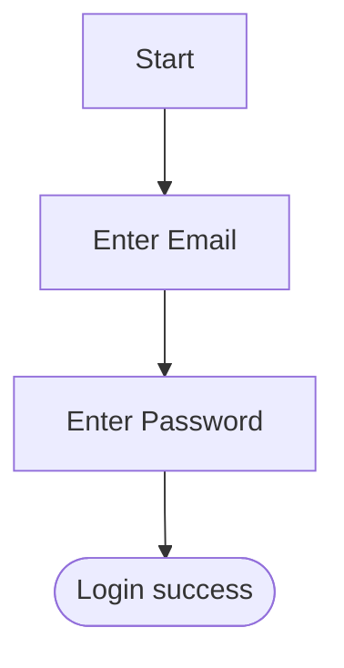

# Требования продукта

| Код требования | Описание требования | Диаграмма | Ссылка на задачу |
|----------------|-------------------|-----------|-----------------|
| REQ-001        | Пользователь должен иметь аккаунт |```mermaid
flowchart TD
Start([Start]) --> Login[Enter credentials]
Login --> Success([Login success])
```| [TASK-123](https://github.com/username/repo/issues/123) |
| REQ-002        | Вход по email и паролю |

| [TASK-124](https://github.com/username/repo/issues/124) |