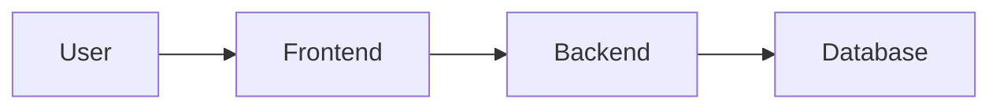
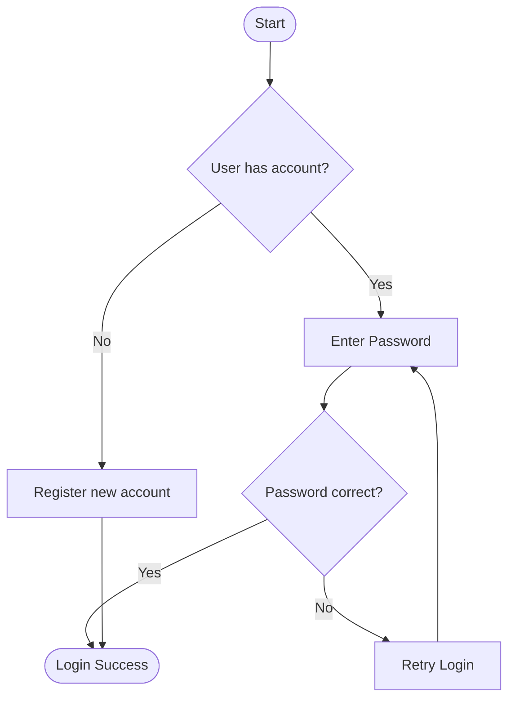
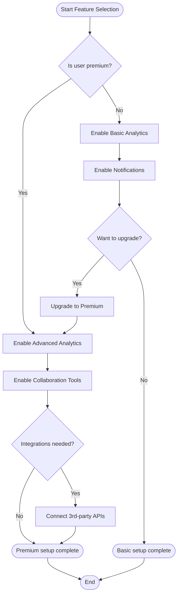

# Architecture

## System overview

```mermaid
flowchart LR
    User --> Frontend
    Frontend --> Backend
    Backend --> Database
```
## System overview 2

```mermaid
flowchart TD
    Start([Start]) --> CheckLogin{User has account?}
    
    CheckLogin -->|Yes| EnterPassword[Enter Password]
    CheckLogin -->|No| Register[Register new account]
    
    EnterPassword --> CheckPass{Password correct?}
    CheckPass -->|Yes| Success([Login Success])
    CheckPass -->|No| Retry[Retry Login]
    
    Retry --> EnterPassword
    Register --> Success
```
## Product Feature Selection Flow

```mermaid
flowchart TD
    Start([Start Feature Selection]) --> CheckUser{Is user premium?}

    %% Premium users
    CheckUser -->|Yes| FeatureA[Enable Advanced Analytics]
    FeatureA --> FeatureB[Enable Collaboration Tools]
    FeatureB --> CheckIntegration{Integrations needed?}
    CheckIntegration -->|Yes| Integration[Connect 3rd-party APIs]
    CheckIntegration -->|No| DonePremium([Premium setup complete])
    Integration --> DonePremium

    %% Free users
    CheckUser -->|No| FeatureC[Enable Basic Analytics]
    FeatureC --> FeatureD[Enable Notifications]
    FeatureD --> CheckUpgrade{Want to upgrade?}
    CheckUpgrade -->|Yes| Upgrade[Upgrade to Premium]
    CheckUpgrade -->|No| DoneFree([Basic setup complete])
    Upgrade --> FeatureA

    %% End states
    DonePremium --> End([End])
    DoneFree --> End
```